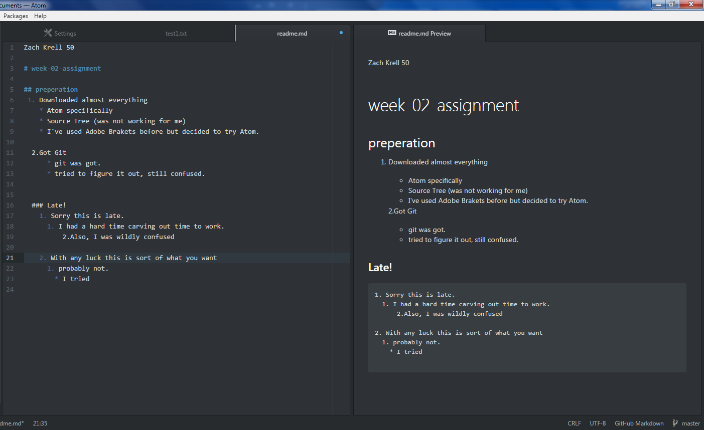

Zach Krell 50

# week-02-assignment

## preperation
 1. Downloaded almost everything
    * Atom specifically
    * Source Tree (was not working for me)
    * I've used Adobe Brakets before but decided to try Atom.     

  2.Got Git
      
      * git was got.
      * tried to figure it out, still confused.

  ### Late!
    1. Sorry this is late.
      1. I had a hard time carving out time to work.
          
          b.Also, I was wildly confused

    2. With any luck this is sort of what you want
      1. probably not.
        * I tried
        
        
        
        
         
